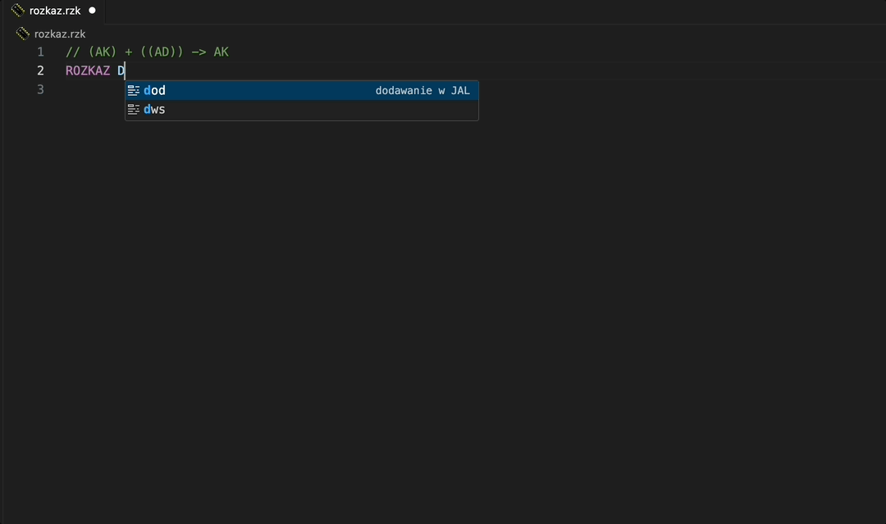
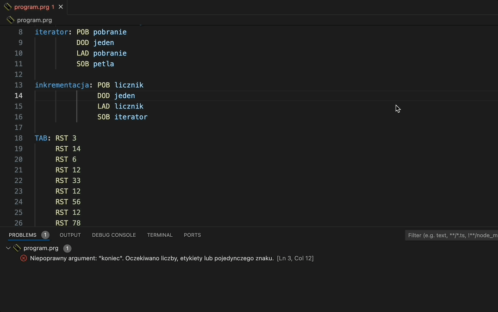

# Podpowiadanie składni języka asemblera i sygnałów sterujących maszyny W 

Rozszerzenie dodaje podpowiadanie i kolorowanie składni oraz analizę syntaktyczną języka asemblera maszyny W stworzonej na wydziale Automatyki, Elektroniki i Informatyki Politechniki Śląskiej.  

Wspiera podpowiadanie i kolorowanie składni sygnałów sterujących <b>bez</b> analizy poprawności zaprojektowanego rozkazu.

> Rozszerzenie rozpoznaje sygnały z wariantu maszyny W+ oraz związane z obsługą stosu.

### Jak zacząć?
Zainstaluj rozszerzenie, stwórz plik z roszerzeniem `.prg` lub `.rzk` i pisz.
Wczytaj napisany skrypt do symulatora wybierając z paska menu <b>Plik</b> a następnie <b>Otwórz..</b> , wczytany plik skompiluj.

### Galeria

|  |  |
|-----------------------------|-----------------------------|